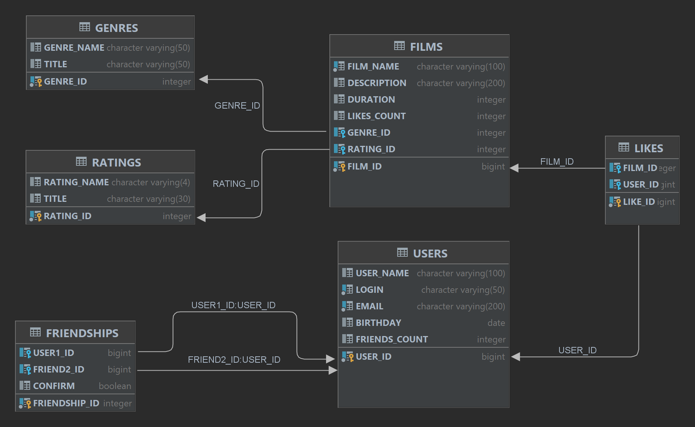

# java-filmorate
Template repository for Filmorate project.

Диаграмма базы данных:

<picture>
<source media="(prefers-color-scheme: dark)" srcset="src/main/resources/FILMORATE_DB_DIAGRAM.png">

</picture>

Запросы:
* 10 популярных фильмов - у фильма постоянно считается поле likes_count, по нему можно сделать отбор
* общие друзья двух друзей - из таблицы FRIENDSHIPS находим друзей пользователя 1, друзей пользователя 2,
    далее средствами java найдем изх пересечение (или средствами бд, если такие есть)
* остальные запросы, типа все пользователи, фильм по id - понятно